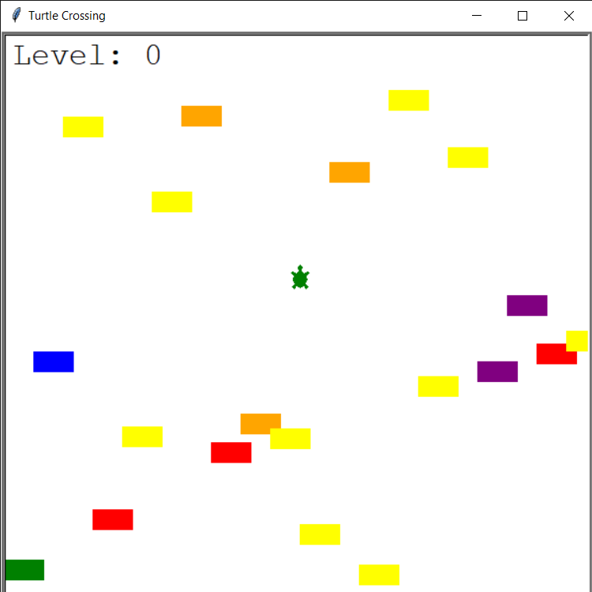

# TURTLE CROSSING

 

## About
This is a Mini-Game in Python.The goal of this game is to 
help a turtle to cross the street. 

## How to Play
Arrow keys to move. Avoid cars and try to not get crushed!

## Gameplay 

***

### Features 
1. Car Spawning System  
2. Level System 
3. Cars get faster every new level

### Modules Used
1. turtle
2. time 

